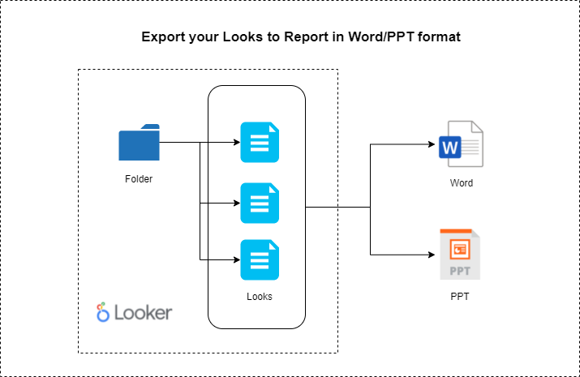

# looker_web_app

We have create a web app by which we can gather all looks in a folder and generate reports in PPT/Word format. Lot of people still use PPTs and Docx for presenting their financial reports , analytical reports etc. We have made report creation a little easier. This project is just a small POC but such an idea can be implemented in Looker as a plugin to generate reports based on folders to G Suite (Google Docs and Google Slides) and Office suite (Microsoft word and Microsoft PowerPoint ).
